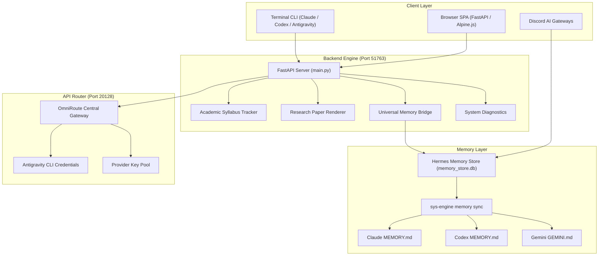

# Personal AI System (Hermes Mission Control)

A self-hosted, multi-agent operating environment and daily workflow dashboard built on top of Hermes Agent, OmniRoute Router, FastAPI, and a Universal Multi-Agent Memory Engine.

[](https://python.org)
[](https://fastapi.tiangolo.com)
[](https://github.com/Dhairya2289/Personal-AI-System)
[](https://github.com/Dhairya2289/Personal-AI-System)
[](LICENSE)

---

## Overview

Personal AI System provides a unified web interface, background services, and multi-agent memory infrastructure. Instead of isolated chat sessions that lose context, the environment compiles structured memories across multiple AI agent runtimes into a persistent SQLite memory store and distributes them across provider memory files.

### Core Modules

* **Universal Multi-Agent Memory (`sys-engine memory`)**: Synchronizes structured facts across Claude CLI, OpenAI Codex, Gemini / Antigravity CLI, Hermes Agents, and the local FastAPI backend.
* **OmniRoute Gateway (`:20128`)**: Local OpenAI-compatible API router that load-balances requests across account credentials and provider pools with fallback strategies.
* **Academic Goal & Syllabus Engine**: Integrates NTA Physics, Chemistry, and Mathematics syllabi weightages to compute daily study blocks, practice question targets, and adherence stats.
* **Research Paper Module**: Rendered Markdown viewer for technical documents, paper summaries, and derivations.
* **System Health Diagnostics (`/api/system/health`)**: Aggregates systemd user service states, process locks, disk free space, and active TCP listeners without blocking or connection timeouts.

---

## System Architecture



```
+-----------------------------------------------------------------------------------+
|                                  CLIENT LAYER                                     |
|  [ Browser SPA ]             [ Discord Gateways ]           [ Terminal CLI ]      |
+--------------------------------─────────┬────────────────────────────────---------+
                                          | REST / IPC
                                          v
+-----------------------------------------------------------------------------------+
|                        FASTAPI BACKEND ENGINE (:51763)                            |
|  [ Syllabus Tracker ]  [ Research Renderer ]  [ Memory Bridge ]  [ Diagnostics ]  |
+--------------------------------─────────┬────────────────────────────────---------+
                                          |
                   +----------------------+----------------------+
                   |                                             |
                   v                                             v
+------------------------------------+        +------------------------------------+
|          MEMORY ENGINE             |        |       OMNIROUTE ROUTER (:20128)    |
| [ Hermes DB (memory_store.db) ]    |        | [ Central Gateway Router ]         |
|      |                             |        |      |                             |
|      v (sys-engine memory sync)    |        |      +---> [ Antigravity Accounts ]|
| [ Claude ]  [ Codex ]  [ Gemini ]  |        |      +---> [ Provider Key Pool ]   |
+------------------------------------+        +------------------------------------+
```

---

## Directory Structure

```
.
├── main.py                     # FastAPI application entrypoint
├── config.py                   # Path and environment resolution
├── system_health.py            # Self-healing diagnostic router
├── memory_bridge.py            # Multi-agent memory bridge
├── tracker.py                  # Syllabus plan and practice engine
├── research.py                 # Markdown research paper module
├── cli/                        # Executable CLI tools
│   └── hermes-memory-sync      # Memory sync executable
├── systemd/                    # Systemd user service templates
│   ├── omniroute.service.example
│   ├── hermes-gateway.service.example
│   ├── hermes-memory-sync.service.example
│   ├── hermes-memory-sync.timer.example
│   └── mission-control.service.example
└── static/                     # Web UI static assets
    ├── index.html
    ├── app.js
    └── style.css
```

---

## Installation & Setup

### Prerequisites
* Linux (CachyOS, Arch, Ubuntu, Fedora)
* Python 3.11+
* SQLite3
* `systemd` (user-session support)

### Installation
```bash
git clone https://github.com/Dhairya2289/Personal-AI-System.git
cd Personal-AI-System

python3 -m venv .venv
source .venv/bin/activate
pip install -r requirements.txt

cp .env.example .env
```

### Running Locally
```bash
uvicorn main:app --host 127.0.0.1 --port 51763
```

### Systemd User Services Setup
```bash
mkdir -p ~/.config/systemd/user
cp systemd/*.example ~/.config/systemd/user/
cd ~/.config/systemd/user
mv mission-control.service.example mission-control.service
mv omniroute.service.example omniroute.service
mv hermes-memory-sync.service.example hermes-memory-sync.service
mv hermes-memory-sync.timer.example hermes-memory-sync.timer

systemctl --user daemon-reload
systemctl --user enable --now mission-control.service omniroute.service hermes-memory-sync.timer
```

---

## CLI Management (`sys-engine`)

The `sys-engine` tool manages background memory operations and system health:

```bash
# Synchronize memory facts across Claude, Codex, Gemini, & Hermes
sys-engine memory sync

# Audit and deduplicate facts in memory database
sys-engine memory lint

# Run system health diagnostics
sys-engine health
```

---

## License

MIT License. See [LICENSE](LICENSE) for details.
