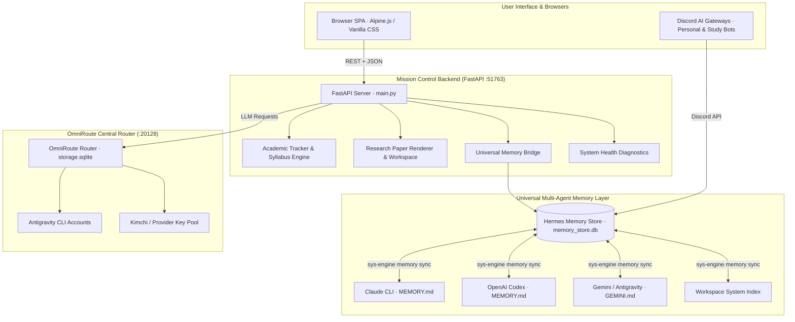

# ⚡ Hermes Mission Control AI OS

> A self-hosted, enterprise-grade AI operating system and daily command center built on top of **Hermes Agent**, **OmniRoute Router**, **FastAPI**, and a **Universal Multi-Agent Memory Engine**. Features briefing, academic tracking, research workspace, memory graph, and terminal bridges — all styled in the **Volt OLED Lime** design system.


---

## 🌟 Architecture Overview



---

## 🔥 Key Highlights & Systems

### 1️⃣ Universal Multi-Agent Memory System (`sys-engine`)
* **Cross-Agent Parity**: Synchronizes 260+ structured facts automatically across **Claude CLI**, **OpenAI Codex**, **Gemini / Antigravity CLI**, **Hermes Agents**, and **Mission Control Dashboard**.
* **Live Learning Policy**: Every instruction or decision shared with Antigravity CLI is automatically mirrored to Hermes long-term memory store so Hermes learns live from all chats.
* **Memory Graph Linting**: Includes automated linting and deduplication CLI (`sys-engine memory lint`) based on Karpathy's LLM Wiki model.

### 2️⃣ OmniRoute Smart Provider Router (`:20128`)
* **Local OpenAI-Compatible Gateway**: Centralized API routing server balancing active Antigravity project connections and Kimchi provider keys.
* **Credit-Efficient Smart Combos**: Auto-routes to `gemini-3.6-flash-high` for sub-second, native SSE streaming while protecting high-cost model quotas.

### 3️⃣ Academic Goal & Syllabus Tracker Engine
* **JEE / NEET 1-Year Master Prep Engine**: Direct syllabus integration from official NTA Physics, Chemistry, and Math syllabi.
* **Daily Plan Generator**: Converts master roadmap specs into daily study blocks, practice question targets, and adherence heatmaps.

### 4️⃣ Self-Healing System Health Diagnostics
* **Real-time Diagnostic Endpoint**: `GET /api/system/health` monitors systemd user services, database locks, disk free space, and active TCP listeners with zero hanging retries (`{"ok": 11, "warn": 1, "down": 0}`).

---

## 📁 Repository Structure

```
.
├── main.py                     # FastAPI application entrypoint
├── config.py                   # Environment & path resolution settings
├── system_health.py            # Self-healing diagnostic router
├── memory_bridge.py            # Multi-agent memory bridge
├── tracker.py                  # JEE/NEET study plan & MCQ engine
├── research.py                 # Markdown research paper renderer
├── cli/                        # Open-source CLI executables
│   └── hermes-memory-sync      # Multi-agent memory distribution CLI
├── systemd/                    # Systemd user service templates
│   ├── omniroute.service.example
│   ├── hermes-gateway.service.example
│   ├── hermes-memory-sync.service.example
│   ├── hermes-memory-sync.timer.example
│   └── mission-control.service.example
├── static/                     # Volt OLED Lime SPA frontend
│   ├── index.html
│   ├── app.js
│   └── style.css
└── docs/                       # Architecture & API documentation
```

---

## 🛠️ Quickstart Installation & Setup

### 1. Prerequisites
- Linux OS (CachyOS, Arch, Ubuntu, Fedora)
- Python 3.11+
- SQLite3
- Node.js / npm (optional for frontend customization)

### 2. Environment Setup
```bash
# Clone the repository
git clone https://github.com/Dhairya2289/mission-control-dashboard.git
cd mission-control-dashboard

# Create virtual environment and install dependencies
python3 -m venv .venv
source .venv/bin/activate
pip install -r requirements.txt

# Copy environment template
cp .env.example .env
```

### 3. Running the Server Locally
```bash
# Start FastAPI backend server on 127.0.0.1:51763
uvicorn main:app --host 127.0.0.1 --port 51763
```

### 4. Setting Up Systemd Services (Autostart)
```bash
# Copy systemd templates to user config
mkdir -p ~/.config/systemd/user
cp systemd/*.example ~/.config/systemd/user/
cd ~/.config/systemd/user
mv mission-control.service.example mission-control.service
mv omniroute.service.example omniroute.service
mv hermes-memory-sync.service.example hermes-memory-sync.service
mv hermes-memory-sync.timer.example hermes-memory-sync.timer

# Enable and start services
systemctl --user daemon-reload
systemctl --user enable --now mission-control.service omniroute.service hermes-memory-sync.timer
```

---

## 🛠️ CLI Management (`sys-engine`)

Management commands are provided via the `sys-engine` tool:

```bash
# Synchronize memory across Claude, Codex, Gemini, & Hermes
sys-engine memory sync

# Audit and deduplicate facts in memory database
sys-engine memory lint

# Run system health diagnostics
sys-engine health
```

---

## 📄 License & Security Statement

This project is licensed under the **MIT License**.

> **Security Note**: This repository contains zero plaintext secrets, personal credentials, or private databases. All credentials and paths are read dynamically from environment variables and local SQLite databases.
