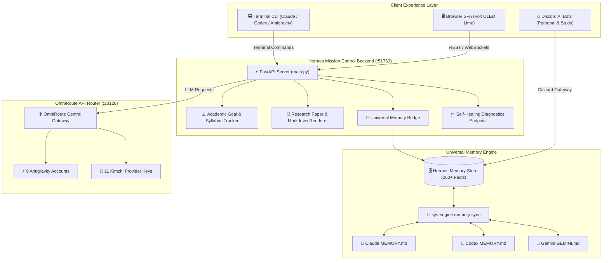

<div align="center">

# ⚡ HERMES MISSION CONTROL AI OS
### *The Self-Hosted, Compounding Personal AI Operating System*

[](https://python.org)
[](https://fastapi.tiangolo.com)
[](https://github.com)
[](https://github.com)
[](LICENSE)

*Stop rediscovering context from scratch on every query. Compile your knowledge, load-balance your LLM API models, and manage your life with a persistent, multi-agent AI environment.*

[Architecture](#-system-architecture) • [Features](#-key-capabilities) • [Quickstart](#-quickstart-installation) • [CLI Management](#-sys-engine-cli)

---

</div>

## 🌌 Why Hermes Mission Control?

Most people's workflow with AI models looks like a repetitive loop of **query-time RAG**: you open a chat window, upload files, get an answer, and close the session. The model forgets everything. Every complex question forces the AI to rediscover knowledge from scratch.

**Hermes Mission Control AI OS** inverts this pattern based on Andrej Karpathy's persistent knowledge base model:

> *"Obsidian is the IDE; the LLM is the programmer; the wiki is the codebase."*

Rather than starting from zero on every query, this system maintains a **living, compounding knowledge lattice** across **Claude CLI**, **OpenAI Codex**, **Gemini / Antigravity**, and **Hermes Agents**. Every breakthrough, study block, research paper, and system decision is extracted, synthesized, and permanently synchronized.

---

## ⚡ Key Capabilities

### 🧠 1. The Brain Lattice (Universal Multi-Agent Memory)
* **Cross-Agent Memory Parity**: One centralized SQLite memory engine (`~/.hermes/memory_store.db`) synchronizing 260+ structured facts across all CLI tools (`Claude`, `Codex`, `Gemini`), Hermes Discord bots, and the web UI.
* **Live Chat Learning**: Every decision or instruction shared in terminal chat is automatically extracted into long-term memory so the AI stack evolves live.
* **Karpathy Knowledge Graph Linting**: Includes automated memory linting (`sys-engine memory lint`) to prune duplicate facts, resolve entity references, and prevent context rot.

### 🌐 2. OmniRoute AI Central Router (`:20128`)
* **On-Device OpenAI-Compatible Router**: Load-balances requests across 9 Antigravity project accounts and 11 Kimchi API keys.
* **Credit-Shield Combos**: Automatically routes heavy workloads to high-efficiency streaming models (`gemini-3.6-flash-high`) while protecting quota-limited models.

### 🎓 3. Academic Goal & Syllabus Vector Engine
* **JEE / NEET Master Syllabi Integration**: Direct integration with official NTA Physics, Chemistry, and Math syllabi weightages.
* **Adherence Heatmaps**: Real-time daily study block tracking, MCQ practice targets, and subject readiness rings.

### 🔬 4. The Paper Matrix (Research Workspace)
* **Interactive Markdown Renderer**: Native renderer for deep research papers, mathematical derivations, and multi-disciplinary briefs without browser bloat.

### 🎨 5. Volt OLED Lime Design System
* **Hardware-Accelerated Dark UI**: Deep OLED `#000000` background with Volt Lime (`#c8ff00`) focal cards, smooth micro-interactions, and zero visual contrast bugs.

---

## 📐 System Architecture



---

## 📂 System Directory Structure

```
├── main.py                     # FastAPI application entrypoint
├── config.py                   # Dynamic environment & path resolution
├── system_health.py            # Self-healing system diagnostic router
├── memory_bridge.py            # Universal multi-agent memory bridge
├── tracker.py                  # JEE/NEET study plan & MCQ engine
├── research.py                 # Markdown research paper renderer
├── cli/                        # System CLI executables
│   └── hermes-memory-sync      # Multi-agent memory sync engine
├── systemd/                    # Systemd user autostart templates
│   ├── omniroute.service.example
│   ├── hermes-gateway.service.example
│   ├── hermes-memory-sync.timer.example
│   └── mission-control.service.example
└── static/                     # Volt OLED Lime SPA frontend
    ├── index.html
    ├── app.js
    └── style.css
```

---

## 🛠️ Quickstart Installation

### 1. Requirements
* Linux (CachyOS, Arch, Ubuntu, Fedora)
* Python 3.11+ & SQLite3
* `systemd` (user-session enabled)

### 2. Installation Steps
```bash
# Clone the repository
git clone https://github.com/Dhairya2289/mission-control-dashboard.git
cd mission-control-dashboard

# Create Python virtual environment & install requirements
python3 -m venv .venv
source .venv/bin/activate
pip install -r requirements.txt

# Copy environment template
cp .env.example .env
```

### 3. Launching the Dashboard
```bash
# Start FastAPI backend server on localhost:51763
uvicorn main:app --host 127.0.0.1 --port 51763
```

### 4. Enabling Background Autostart Services
```bash
# Install systemd user service templates
mkdir -p ~/.config/systemd/user
cp systemd/*.example ~/.config/systemd/user/
cd ~/.config/systemd/user
mv mission-control.service.example mission-control.service
mv omniroute.service.example omniroute.service
mv hermes-memory-sync.timer.example hermes-memory-sync.timer

# Enable & activate services
systemctl --user daemon-reload
systemctl --user enable --now mission-control.service omniroute.service hermes-memory-sync.timer
```

---

## 🕹️ `sys-engine` CLI Commands

Manage memory, run health checks, and execute graph linting with the unified CLI:

```bash
# Synchronize memory facts across Claude, Codex, Gemini, & Hermes
sys-engine memory sync

# Audit and lint the memory graph for duplicate facts
sys-engine memory lint

# Run full system diagnostic benchmark
sys-engine health
```

---

## 🛡️ Security & Privacy

This repository contains **zero hardcoded secrets, private notes, or API keys**. All credentials, database paths, and API endpoints are read dynamically from environment variables (`.env`) and local SQLite database files.

---

<div align="center">

### 📄 License
Licensed under the [MIT License](LICENSE).

*Engineered for maximum productivity, persistent memory compounding, and mouseless operation.*

</div>
