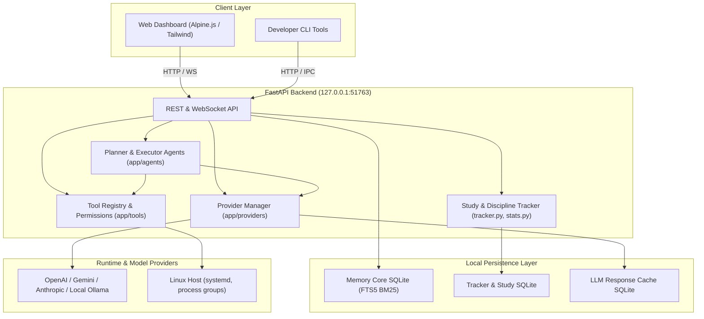

# Personal AI Mission Control

Personal AI Mission Control is a self-hosted control plane for AI agent orchestration, persistent SQLite memory, study analytics, and Linux system automation.

Built with **FastAPI**, **SQLite (FTS5)**, and **Alpine.js**, it coordinates background agent tasks, indexes persistent semantic memories across tools, tracks structured study roadmaps, and monitors host system health without external telemetry or proprietary cloud lock-in.

---

## Architecture


```mermaid
flowchart TD
    subgraph Client ["Client Layer"]
        SPA["Web Dashboard (Alpine.js / Tailwind)"]
        CLI["Developer CLI Tools"]
    end

    subgraph Server ["FastAPI Backend (127.0.0.1:51763)"]
        API["REST & WebSocket API"]
        PROV["Provider Manager (app/providers)"]
        REG["Tool Registry & Permissions (app/tools)"]
        AGENT["Planner & Executor Agents (app/agents)"]
        STATS["Study & Discipline Tracker (tracker.py, stats.py)"]
    end

    subgraph Storage ["Local Persistence Layer"]
        MEM_DB["Memory Core SQLite (FTS5 BM25)"]
        TRACK_DB["Tracker & Study SQLite"]
        CACHE_DB["LLM Response Cache SQLite"]
    end

    subgraph External ["Runtime & Model Providers"]
        LLM["OpenAI / Gemini / Anthropic / Local Ollama"]
        SYS["Linux Host (systemd, process groups)"]
    end

    SPA -->|HTTP / WS| API
    CLI -->|HTTP / IPC| API

    API --> PROV
    API --> REG
    API --> STATS
    API --> AGENT

    AGENT --> REG
    AGENT --> PROV

    PROV --> LLM
    PROV --> CACHE_DB
    REG --> SYS
    API --> MEM_DB
    STATS --> TRACK_DB
```

---

## Core Subsystems

### 1. Resilient Provider Abstraction (`app/providers/`)
* **Multi-Provider Support**: Direct REST adapters for OpenAI, Google Gemini, Anthropic Claude, Groq, OpenRouter, and local offline Ollama.
* **Circuit Breaker**: Automatically trips on 3 consecutive failures, enforces a 60-second cooldown, and tests recovery via half-open probe transitions.
* **Sliding-Window Rate Limiter**: Proactively tracks requests per minute (RPM) and requests per day (RPD) to avoid 429 quota exhaustion.
* **SQLite Response Caching**: Keyed SHA-256 request hashing with configurable TTLs and cache hit accounting.
* **Task-Driven Fallback**: Automatic fallback chains (`speed`, `code`, `logic`, `research`, `local`) that route to backup providers when primary services degrade.

### 2. Memory Engine (`memory.py`)
* **Hybrid Lexical Search**: SQLite FTS5 (BM25) full-text indexing with logistic relevance squashing.
* **Recency & Decay**: Tier-based exponential decay (`_HALF_LIFE_DAYS`) boosted on read access.
* **Semantic Taxonomy**: Typed memories categorized by `fact`, `preference`, `error`, `task`, `insight`, `concept`, or `decision`.
* **Confidence Scoring**: 0.0–1.0 metadata field weighting retrieval rankings alongside lexical match and salience.
* **Safe Schema Migration**: Auto-migrates legacy SQLite databases via non-destructive `ALTER TABLE` operations.

### 3. Permission-Gated Tool System (`app/tools/`, `app/agents/`)
* **Explicit Risk Tiers**:
  * `LOW` (Read-only): File reading, directory listing, memory search (auto-executed).
  * `MEDIUM` (State-creating): Note taking, file creation (audit logged).
  * `HIGH` (System-altering): Terminal execution, file deletion (requires explicit confirmation token).
* **Process-Group Isolation**: Shell commands run in dedicated process groups (`os.setsid`) with SIGTERM → SIGKILL escalation on timeout.
* **System Invariants**: Hardcoded runtime checks that prevent touching boot-critical packages or destructive paths.
* **ReAct Execution**: Structured planning (`PlannerAgent`) and iterative tool execution (`ExecutorAgent`).

### 4. Study & Progress Analytics (`tracker.py`, `stats.py`)
* **Discipline Scoring**: 100-point daily score based on study block completion, practice questions, and daily execution metrics.
* **Executive Overview**: `/api/stats/executive-overview` aggregates active streak, subject-level study hours, task progress, and AI ops telemetry.

---

## Security Model

* **Localhost Binding**: Binds exclusively to `127.0.0.1:51763` by default. Remote access is designed to go through SSH tunneling or private overlay networks (Tailscale).
* **Strict Process Safety**: Rejects arbitrary `shell=True` blacklisting in favor of structured argument evaluation and process-group isolation.
* **Fail-Safe Read Only**: External data sources degrade to read-only mode (`file:path?mode=ro`) to prevent accidental state corruption.

---

## Quick Start

### Prerequisites
* Linux (CachyOS, Arch, Ubuntu, or Debian recommended)
* Python 3.11+
* Git

### Installation

```bash
# 1. Clone repository
git clone https://github.com/Dhairya2289/Personal-AI-System.git
cd Personal-AI-System

# 2. Set up virtual environment
python3 -m venv .venv
source .venv/bin/activate

# 3. Install dependencies
pip install -r requirements-dev.txt

# 4. Configure environment
cp .env.example .env
# Edit .env with your preferred API keys or local endpoints
```

### Running the Server

```bash
uvicorn main:app --host 127.0.0.1 --port 51763 --reload
```

Access the dashboard at `http://127.0.0.1:51763`.

---

## Testing & Quality

The codebase enforces linting and unit test coverage via GitHub Actions:

```bash
# Run unit tests
pytest tests/unit/ -v

# Run linter
ruff check app tests

# Verify Python syntax
python -m py_compile *.py app/**/*.py
```

---

## Architecture Decision Records (ADRs)

Key architectural decisions are documented under [`docs/decisions/`](docs/decisions/):
* [ADR 001: SQLite and FTS5 for Persistent Local Memory](docs/decisions/001-sqlite-fts5-persistence.md)
* [ADR 002: Process-Group Isolation for Local Tool Execution](docs/decisions/002-process-group-isolation.md)
* [ADR 003: Multi-Tier Permission Model for Agent Tools](docs/decisions/003-tool-permission-gating.md)
* [ADR 004: Action-Bound Confirmation Tokens](docs/decisions/004-action-bound-confirmations.md)

---

## License

MIT License. See [LICENSE](LICENSE) for details.
